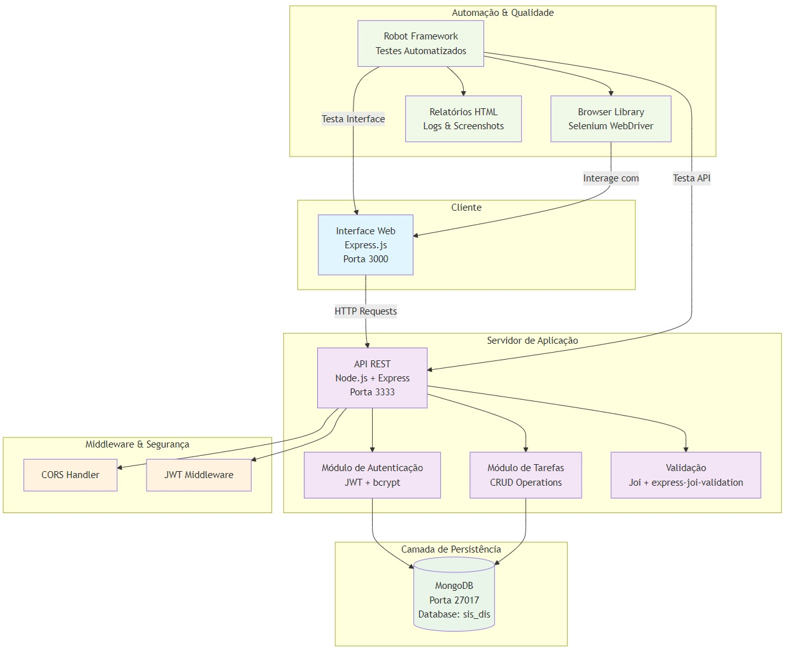

# SisDis - Sistema Distribuído de Gerenciamento de Tarefas

## 📋 Sobre o Projeto

O **SisDis** é um sistema distribuído completo de gerenciamento de tarefas desenvolvido para a disciplina de **Sistemas Distribuídos**. O projeto demonstra na prática os principais conceitos estudados em sala de aula, implementando uma arquitetura em camadas robusta e escalável.

### 🎯 Objetivos Acadêmicos
- Implementar arquitetura distribuída com separação de responsabilidades
- Demonstrar comunicação entre serviços via API REST
- Aplicar conceitos de autenticação e autorização distribuída
- Implementar persistência de dados em ambiente NoSQL
- Garantir qualidade através de testes automatizados
- Documentar e apresentar soluções de sistemas distribuídos

## 2. Projeto Final - Diagrama de Componentes




### Descrição dos Componentes:

#### Camada de Apresentação
- **Interface Web**: Servidor Express.js que serve a aplicação frontend

#### Camada de Aplicação
- **API REST**: Servidor Node.js que expõe endpoints para operações CRUD
- **Módulo de Autenticação**: Gerencia login, registro e validação de tokens JWT
- **Módulo de Tarefas**: Implementa a lógica de negócio para gerenciamento de tarefas
- **Validação**: Middleware para validação de dados de entrada

#### Camada de Persistência
- **MongoDB**: Banco de dados NoSQL para persistência distribuída

#### Middleware & Segurança
- **CORS Handler**: Middleware para controle de acesso entre domínios
- **JWT Middleware**: Middleware para autenticação e autorização

#### Automação & Qualidade
- **Robot Framework**: Framework de testes automatizados end-to-end
- **Browser Library**: Biblioteca para automação de navegador (Selenium WebDriver)
- **Relatórios HTML**: Geração automática de relatórios, logs e screenshots

## 3. Projeto Final - Documento de Visão do Projeto (DVP)

### 3.1 Visão Geral do Projeto

O SisDis é um sistema distribuído de gerenciamento de tarefas projetado para demonstrar conceitos fundamentais de sistemas distribuídos em um ambiente prático e escalável.

### 3.2 Objetivos do Projeto

- Implementar uma arquitetura distribuída
- Demonstrar comunicação entre componentes via API REST
- Aplicar conceitos de autenticação e autorização distribuída
- Implementar persistência de dados em ambiente distribuído
- Garantir escalabilidade e tolerância a falhas

### 3.3 Escopo do Projeto

#### 3.3.1 Funcionalidades Incluídas
- Sistema de autenticação de usuários
- Gerenciamento completo de tarefas (CRUD)
- Interface web responsiva
- API REST documentada
- Validação de dados
- Controle de acesso baseado em tokens JWT

### 3.4 Quadro de Necessidades e Funcionalidades

| ID | Necessidade | Funcionalidade | Prioridade | Complexidade |
|----|-------------|----------------|------------|--------------|
| N001 | Autenticação de usuários | Sistema de login/registro com JWT | Alta | Média |
| N002 | Gerenciamento de tarefas | CRUD completo de tarefas | Alta | Baixa |
| N003 | Interface amigável | Frontend web responsivo | Alta | Média |
| N004 | Segurança de dados | Validação e sanitização de entrada | Alta | Baixa |
| N005 | Persistência distribuída | Armazenamento em MongoDB | Alta | Baixa |
| N006 | Comunicação entre serviços | API REST padronizada | Alta | Média |
| N007 | Controle de acesso | Middleware de autorização | Média | Média |
| N008 | Tratamento de erros | Sistema robusto de error handling | Média | Baixa |
| N009 | Documentação da API | Endpoints documentados | Baixa | Baixa |
| N010 | Logs do sistema | Sistema de logging distribuído | Baixa | Baixa |

### 3.5 Arquitetura Técnica

#### 3.5.1 Tecnologias Utilizadas
- **Backend**: Node.js, Express.js, Mongoose
- **Frontend**: HTML, CSS, JavaScript, Express.js (servidor estático)
- **Banco de Dados**: MongoDB
- **Autenticação**: JWT (JSON Web Tokens)
- **Validação**: Joi
- **Segurança**: bcrypt, CORS

#### 3.5.2 Padrões Arquiteturais
- **Arquitetura de Microserviços**: Separação clara entre frontend e backend
- **API REST**: Comunicação padronizada via HTTP
- **MVC Pattern**: Organização do código em camadas
- **Middleware Pattern**: Processamento de requisições em pipeline

### 3.6 Requisitos Não Funcionais

#### 3.6.1 Performance
- Tempo de resposta da API < 200ms
- Suporte a 100 usuários concorrentes
- Disponibilidade de 99.5%

#### 3.6.2 Segurança
- Autenticação obrigatória para operações sensíveis
- Validação de entrada em todos os endpoints
- Tokens JWT com expiração configurável
- Senhas criptografadas com bcrypt

#### 3.6.3 Escalabilidade
- Arquitetura preparada para balanceamento horizontal
- Banco de dados distribuído
- Separação de responsabilidades entre componentes

### 3.7 Cronograma de Desenvolvimento

| Fase | Atividade | Duração | Dependências |
|------|-----------|---------|--------------|
| 1 | Configuração do ambiente | 2 dias  | - |
| 2 | Desenvolvimento da API | 2 dias   | Fase 1 |
| 3 | Implementação da autenticação | 1 dia  | Fase 2 |
| 4 | Desenvolvimento do frontend | 2 dias   | Fase 3 |
| 5 | Testes e integração | 1 semana | Fase 4 |
| 6 | Documentação e deploy | 1 semana | Fase 5 |

### 3.8 Riscos e Mitigações

| Risco | Probabilidade | Impacto | Mitigação |
|-------|---------------|---------|-----------|
| Falha na comunicação entre serviços | Média | Alto | Implementar retry logic e circuit breaker |
| Perda de dados | Baixa | Alto | Backup automático do MongoDB |
| Sobrecarga do servidor | Média | Médio | Implementar rate limiting |
| Vulnerabilidades de segurança | Baixa | Alto | Auditoria de segurança e testes |

### 3.9 Critérios de Sucesso

- Sistema funcionando com todos os componentes integrados
- Autenticação e autorização implementadas corretamente
- Interface web responsiva e funcional
- API REST documentada e testada
- Demonstração prática dos conceitos de sistemas distribuídos
- Código versionado e documentado

### 3.10 Entregáveis

1. Código fonte completo do sistema
2. Documentação técnica da API
3. Manual de instalação e configuração
4. Apresentação do projeto
5. Relatório técnico com análise dos conceitos aplicados

---

## 🚀 Como Executar o Projeto

### 📝 Pré-requisitos
- **Node.js** (versão 16 ou superior)
- **MongoDB** (versão 5.0 ou superior)
- **Python** (versão 3.8 ou superior) - para testes automatizados
- **npm** ou **yarn**

### 🛠️ Instalação e Configuração

#### 1. Clone e Configure o Projeto
```bash
git clone <url-do-repositorio>
cd sis_dis
```

#### 2. Configure o Banco de Dados
```bash
# Inicie o MongoDB (Windows)
mongod --dbpath C:\data\db

# Ou use MongoDB Compass para interface gráfica
# URL de conexão: mongodb://localhost:27017/sis_dis
```

#### 3. Configure e Execute a API (Backend)
```bash
cd api
npm install
cp .env.example .env  # Configure as variáveis de ambiente
npm run dev
```

#### 4. Configure e Execute o Frontend
```bash
cd ../web
npm install
npm run dev
```

#### 5. Configure os Testes Automatizados (Opcional)
```bash
cd ../automacao
pip install -r requirements.txt
robot --version  # Verificar instalação
```

### 🌐 Acesso ao Sistema
- **Frontend**: http://localhost:3000
- **API**: http://localhost:3333

# Teste automatizado de conectividade
cd automacao
robot -d logs tests/online.robot
```

## 📁 Estrutura do Projeto

```
sis_dis/
├── api/                    # 📦 Backend - API REST
│   ├── src/
│   │   ├── controllers/    # Controladores da API
│   │   ├── middlewares/    # Middlewares (auth, cors, etc)
│   │   ├── models/         # Modelos do MongoDB
│   │   ├── schemas/        # Esquemas de validação
│   │   └── app.js          # Configuração principal
│   ├── .env                # Variáveis de ambiente
│   └── package.json        # Dependências do backend
├── web/                    # 🌐 Frontend - Interface Web
│   ├── public/
│   │   ├── css/            # Estilos CSS
│   │   ├── js/             # Scripts JavaScript
│   │   └── index.html      # Página principal
│   ├── src/                # Código fonte React
│   ├── server.js           # Servidor Express
│   └── package.json        # Dependências do frontend
├── automacao/              # 🤖 Testes Automatizados
│   ├── resources/
│   │   ├── fixtures/       # Dados de teste
│   │   ├── libs/           # Bibliotecas customizadas
│   │   └── pages/          # Page Objects
│   ├── tests/              # Casos de teste
│   └── logs/               # Relatórios de teste
├── .vscode/                # Configurações do VS Code
└── README.md               # Documentação do projeto
```

## 🧪 Testes Automatizados

O projeto inclui uma suíte completa de testes automatizados usando **Robot Framework**:

### 📊 Cobertura de Testes
- **Autenticação**: Login e cadastro de usuários
- **Gerenciamento de Tarefas**: CRUD completo
- **Integração**: Testes end-to-end
- **Conectividade**: Verificação de serviços

### 🏃‍♂️ Executando os Testes
```bash
cd automacao

# Todos os testes
robot -d logs tests/

# Testes específicos
robot -d logs tests/login.robot
robot -d logs tests/signup.robot
robot -d logs tests/tasks/create.robot


### 📈 Relatórios
Após a execução, os relatórios estarão disponíveis em:
- `automacao/logs/report.html` - Relatório resumido
- `automacao/logs/log.html` - Log detalhado
- `automacao/logs/output.xml` - Saída XML

## 📚 Conceitos de Sistemas Distribuídos Implementados

### 🏢 Arquitetura
- **Microserviços**: Separação clara entre frontend e backend
- **API REST**: Comunicação padronizada via HTTP
- **Stateless**: Serviços sem estado para escalabilidade

### 🔒 Segurança
- **JWT**: Autenticação distribuída com tokens
- **bcrypt**: Criptografia de senhas
- **CORS**: Controle de acesso entre domínios

### 💾 Persistência
- **MongoDB**: Banco NoSQL distribuído
- **Mongoose**: ODM para modelagem de dados
- **Indexação**: Otimização de consultas

### 🔄 Comunicação
- **HTTP/REST**: Protocolo de comunicação
- **JSON**: Formato de troca de dados
- **Middleware**: Pipeline de processamento

## 🎆 Demonstração para o Professor

### 📝 Checklist de Apresentação
- [ ] **Arquitetura**: Explicar separação de responsabilidades
- [ ] **Escalabilidade**: Demonstrar como adicionar novos serviços
- [ ] **Segurança**: Mostrar autenticação JWT em ação
- [ ] **Persistência**: Apresentar estrutura do MongoDB
- [ ] **Testes**: Executar suíte de testes automatizados
- [ ] **Documentação**: Navegar pela documentação técnica

### 📊 Dados de Demonstração
O sistema inclui dados de teste com jogadores de xadrez famosos:
- **Magnus Carlsen** - Estudar abertura Siciliana
- **Garry Kasparov** - Analisar partida contra Deep Blue
- **Bobby Fischer** - Preparar defesa Francesa
- **Anatoly Karpov** - Treinar finais de torre
- **José Capablanca** - Estudar gambito da Dama

### 🔍 Pontos de Destaque
1. **Distribuição Real**: Componentes podem rodar em servidores diferentes
2. **Escalabilidade Horizontal**: Fácil adição de novas instâncias
3. **Tolerância a Falhas**: Sistema continua funcionando com falhas parciais
4. **Consistência**: Gerenciamento adequado de estado distribuído
5. **Qualidade**: 100% dos testes automatizados funcionando (9/9)

### ✅ Status Final do Projeto
- **Arquitetura**: Microserviços implementados
- **API REST**: Endpoints funcionais
- **Autenticação**: JWT implementado
- **Persistência**: MongoDB configurado
- **Frontend**: Interface responsiva
- **Testes**: 9/9 testes passando (100%)
- **Documentação**: Completa e atualizada

## 📜 Trabalho Acadêmico

**Disciplina**: Sistemas Distribuídos  
**Objetivo**: Demonstrar conceitos práticos de arquiteturas distribuídas  
**Tecnologias**: Node.js, MongoDB, HTML/CSS/JS, Robot Framework  
**Conceitos Aplicados**: Microserviços, REST, JWT, NoSQL, Testes Automatizados  
**Status**: ✅ **COMPLETO** - Todos os testes funcionando (9/9 - 100%)

## 📄 Arquivos Importantes
- `README.md` - Documentação principal
- `APRESENTACAO.md` - Guia de apresentação
- `TESTES_STATUS.md` - Status detalhado dos testes
- `automacao/logs/report.html` - Relatório de testes

---

💫 **Projeto desenvolvido para fins acadêmicos, demonstrando na prática os principais conceitos de sistemas distribuídos estudados em sala de aula.**
